# mvd Integration Tests — Decision Tree

```mermaid
graph TD
    MVD["mvd SRC [DST]"]
    MVD --> M_MOVE["Mode: Move<br/><i>no flag, 2 args</i>"]
    MVD --> M_WT["Mode: Worktree add<br/><i>-w / --worktree</i>"]
    MVD --> M_ADD["Mode: Add<br/><i>--add</i>"]
    MVD --> M_RM["Mode: Remove<br/><i>--rm / --remove</i>"]
    MVD --> M_REBASE["Mode: Rebase<br/><i>--rebase</i>"]
    MVD --> M_BACK["Mode: Back<br/><i>--back</i>"]
    MVD --> M_LIST["Mode: List<br/><i>--list</i>"]
    MVD --> M_CLEAR["Mode: Clear<br/><i>--clear</i>"]
    MVD --> M_ERR["Error handling"]

    %% Move mode
    M_MOVE --> M_WT_CHECK{"SRC is a<br/>git worktree?"}
    M_WT_CHECK -->|"Yes (os.Rename,<br/>not git worktree move)"| M_NESTED{"Nested worktree<br/>(worktree of worktree)?"}
    M_NESTED -->|Yes| T_NESTED["testMoveNestedWorktreeWithoutWFlag<br/><i>test_move_worktree_without_w_flag...</i>"]
    M_NESTED -->|No| T_MV_WT["testMoveWorktreeWithoutWFlagShouldDoSimpleMove<br/><i>test_move_worktree_without_w_flag...</i>"]
    M_WT_CHECK -->|No| M_SHORT{"SRC is a<br/>short name?"}
    M_SHORT -->|"Root path"| T_ROOT["testMoveAsRootPath<br/><i>test_move.go</i>"]
    M_SHORT -->|"Unique basename"| T_BN["testMoveByBasename<br/><i>test_move.go</i>"]
    M_SHORT -->|"Alias"| T_ALIAS["testMoveByAlias<br/><i>test_move.go</i>"]
    M_SHORT -->|"Ambiguous<br/>→ error"| T_AMB["testAmbiguousBasename<br/><i>test_move.go</i>"]
    M_SHORT -->|"No (full path)"| M_DST{"DST exists<br/>as a directory?"}
    M_DST -->|Yes| T_TO_DIR["testMoveToExistingDir<br/><i>test_move.go</i>"]
    M_DST -->|No| M_CHAIN{"Multi-step<br/>chain?"}
    M_CHAIN -->|Yes| T_CHAIN["testMultiStepMove<br/><i>test_move.go</i>"]
    M_CHAIN -->|No| T_BASIC["testBasicMove<br/><i>test_move.go</i>"]

    %% Worktree mode
    M_WT --> WT_IS_REPO{"SRC is a<br/>git repo?"}
    WT_IS_REPO -->|No| T_WT_NOGIT["→ error<br/>testWorktreeNonGitSrc<br/><i>test_worktree.go</i>"]
    WT_IS_REPO -->|Yes| WT_COLLIDE{"Branch name<br/>collision?"}
    WT_COLLIDE -->|Yes| T_WT_COL["→ date-suffixed branch<br/>testWorktreeBranchCollision<br/><i>test_worktree.go</i>"]
    WT_COLLIDE -->|No| T_WT_OK["→ worktree created<br/>testWorktreeMove<br/>testMoveWorktreeWithWFlagShouldRunGitWorktreeAdd<br/><i>test_worktree.go + ...with_w_flag...</i>"]

    %% Add mode
    M_ADD --> ADD_DUP{"Already<br/>recorded?"}
    ADD_DUP -->|Yes| T_ADD_DUP["→ no-op<br/>testAddDuplicate<br/><i>test_add.go</i>"]
    ADD_DUP -->|No| T_ADD["→ added<br/>testAdd<br/><i>test_add.go</i>"]

    %% Remove mode
    M_RM --> RM_HIST{"Has movement<br/>history?"}
    RM_HIST -->|No| T_RM["→ removed<br/>testRemove<br/><i>test_remove.go</i>"]
    RM_HIST -->|Yes| RM_FORCE{"--force?"}
    RM_FORCE -->|Yes| T_RM_F["→ cleared<br/>testRemoveForce<br/><i>test_remove.go</i>"]
    RM_FORCE -->|No| T_RM_NF["→ error<br/>testRemoveNoForceWithHistory<br/><i>test_remove.go</i>"]

    %% Rebase mode
    M_REBASE --> T_REBASE["testRebase<br/><i>test_rebase.go</i>"]

    %% Back mode
    M_BACK --> BK_WT{"Created via<br/>mvd -w?"}
    BK_WT -->|Yes| BK_DIRTY{"Uncommitted<br/>changes?"}
    BK_DIRTY -->|Yes| T_BK_DIRTY["→ error<br/>testWorktreeBackDirty<br/><i>test_worktree.go</i>"]
    BK_DIRTY -->|No| BK_MERGED{"Branch merged<br/>into main?"}
    BK_MERGED -->|No| T_BK_UNM["→ error<br/>testWorktreeBackUnmerged<br/><i>test_worktree.go</i>"]
    BK_MERGED -->|Yes| T_BK_OK["→ worktree removed<br/>testWorktreeBackSuccess<br/><i>test_worktree.go</i>"]
    BK_WT -->|No| BK_ORIGIN{"Already at<br/>origin?"}
    BK_ORIGIN -->|Yes| T_BK_ORIGIN["→ no-op<br/>testBackAtOrigin<br/><i>test_back.go</i>"]
    BK_ORIGIN -->|No| BK_MULTI{"Multi-step<br/>chain?"}
    BK_MULTI -->|Yes| T_BK_MULTI["testMultiStepBack<br/><i>test_back.go</i>"]
    BK_MULTI -->|No| BK_SRC{"Source<br/>resolution?"}
    BK_SRC -->|"By basename"| T_BK_BN["testBackByBasename<br/><i>test_back.go</i>"]
    BK_SRC -->|"By path"| T_BK["testBack<br/><i>test_back.go</i>"]

    %% List mode
    M_LIST --> LIST_ARG{"SRC arg<br/>provided?"}
    LIST_ARG -->|Yes| T_LIST1["testListSingle<br/><i>test_list.go</i>"]
    LIST_ARG -->|No| T_LISTA["testListAll<br/><i>test_list.go</i>"]

    %% Clear mode
    M_CLEAR --> T_CLEAR["testClear<br/><i>test_clear.go</i>"]

    %% Error
    M_ERR --> T_ERR["→ error<br/>testNonExistentSrc<br/><i>test_error.go</i>"]

    %% Styles
    classDef mode fill:#e1f5fe,stroke:#0288d1
    classDef decision fill:#fff9c4,stroke:#fbc02d
    classDef test fill:#e8f5e9,stroke:#388e3c
    classDef error fill:#ffebee,stroke:#c62828

    class M_MOVE,M_WT,M_ADD,M_RM,M_REBASE,M_BACK,M_LIST,M_CLEAR,M_ERR mode
    class M_WT_CHECK,M_NESTED,M_SHORT,M_DST,M_CHAIN,WT_IS_REPO,WT_COLLIDE,ADD_DUP,RM_HIST,RM_FORCE,BK_WT,BK_DIRTY,BK_MERGED,BK_ORIGIN,BK_MULTI,BK_SRC,LIST_ARG decision
    class T_NESTED,T_MV_WT,T_ROOT,T_BN,T_ALIAS,T_AMB,T_TO_DIR,T_CHAIN,T_BASIC,T_WT_NOGIT,T_WT_COL,T_WT_OK,T_ADD_DUP,T_ADD,T_RM,T_RM_F,T_RM_NF,T_REBASE,T_BK_DIRTY,T_BK_UNM,T_BK_OK,T_BK_ORIGIN,T_BK_MULTI,T_BK_BN,T_BK,T_LIST1,T_LISTA,T_CLEAR,T_ERR test
```



## Text Tree (fallback)

```
mvd command
│
├── Mode: Move (no flag, 2 args: SRC DST)
│   ├── SRC is a git worktree? ──→ os.Rename (not git worktree move)
│   │   ├── Yes, nested? → testMoveNestedWorktreeWithoutWFlag
│   │   └── Yes, direct → testMoveWorktreeWithoutWFlagShouldDoSimpleMove
│   └── SRC is not a worktree
│       ├── SRC is a short name?
│       │   ├── Root path match  → testMoveAsRootPath
│       │   ├── Unique basename  → testMoveByBasename
│       │   ├── Alias            → testMoveByAlias
│       │   └── Ambiguous        → error: testAmbiguousBasename
│       └── SRC is a full path
│           ├── DST exists as dir? → testMoveToExistingDir
│           ├── Multi-step chain?  → testMultiStepMove
│           └── Simple             → testBasicMove
│
├── Mode: Worktree (-w SRC DST)
│   ├── SRC not a git repo → error: testWorktreeNonGitSrc
│   └── SRC is a git repo
│       ├── Branch name collision? → date-suffixed: testWorktreeBranchCollision
│       └── Branch name free       → testWorktreeMove / testMoveWorktreeWithWFlagShouldRunGitWorktreeAdd
│
├── Mode: Add (--add DIR)
│   ├── Already recorded? → no-op: testAddDuplicate
│   └── New               → added: testAdd
│
├── Mode: Remove (--rm DIR)
│   ├── No history  → removed: testRemove
│   └── Has history
│       ├── --force → cleared: testRemoveForce
│       └── no -f   → error:  testRemoveNoForceWithHistory
│
├── Mode: Rebase (--rebase DIR NEW-DIR)
│   └── testRebase
│
├── Mode: Back (--back SRC)
│   ├── Created via mvd -w?
│   │   └── Yes
│   │       ├── Dirty?         → error: testWorktreeBackDirty
│   │       ├── Not merged?    → error: testWorktreeBackUnmerged
│   │       └── Clean+merged   → removed: testWorktreeBackSuccess
│   └── Regular directory
│       ├── At origin?   → no-op: testBackAtOrigin
│       ├── Multi-step?  → testMultiStepBack
│       ├── By basename  → testBackByBasename
│       └── By path      → testBack
│
├── Mode: List (--list [SRC])
│   ├── With SRC arg → testListSingle
│   └── Without arg  → testListAll
│
├── Mode: Clear (--clear SRC)
│   └── testClear
│
└── Error handling
    └── SRC does not exist → testNonExistentSrc
```

## Test File Index

| File | Test Functions |
|------|---------------|
| `test_move.go` | testBasicMove, testMoveToExistingDir, testMultiStepMove, testMoveAsRootPath, testMoveByBasename, testMoveByAlias, testAmbiguousBasename |
| `test_add.go` | testAdd, testAddDuplicate |
| `test_remove.go` | testRemove, testRemoveForce, testRemoveNoForceWithHistory |
| `test_rebase.go` | testRebase |
| `test_back.go` | testBack, testBackAtOrigin, testBackByBasename, testMultiStepBack |
| `test_list.go` | testListAll, testListSingle |
| `test_clear.go` | testClear |
| `test_error.go` | testNonExistentSrc |
| `test_worktree.go` | testWorktreeMove, testWorktreeNonGitSrc, testWorktreeBackDirty, testWorktreeBackUnmerged, testWorktreeBackSuccess, testWorktreeBranchCollision |
| `test_move_worktree_without_w_flag_should_do_simple_move.go` | testMoveWorktreeWithoutWFlagShouldDoSimpleMove, testMoveNestedWorktreeWithoutWFlag |
| `test_move_worktree_with_w_flag_should_run_git_worktree_add.go` | testMoveWorktreeWithWFlagShouldRunGitWorktreeAdd |
| `main.go` | Driver: test framework, helpers, `main()` runner |
